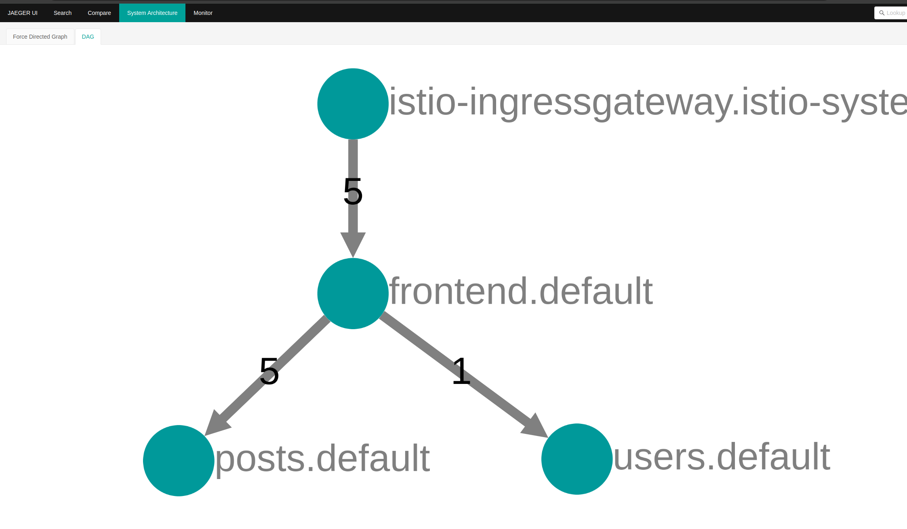

# Microservice Topology Generator

### Handcrafting Benchmarks Sucks
The aim of this tool is to automatically generate code and config for given microservice topologies. We find that the functionality of microservices
doesn't really matter for system performance, and implementing these features for benchmarks is a waste of time. What we really care about is the service topology,
potential call graphs, call sizes, and differences in compute between services.


## Usage

Define your topology wherever you want, the default location is just `topology.yaml`. 

In `topology.yaml`, define your list of services and dependencies as so:

```yaml
services:
  - name: foo
    methods:
      - method: POST
        path: /postfoo
        calls:
          - name: bar
            method: POST
            path: /postbar
            size: 1024
  - name: bar
    methods:
      - method: POST
        path: /postbar
        computeAmount: 20
        computeDuration: 50
        returnSize: 1024
```

The above topology is very simple, just foo calls bar. We also define that the endpoint on foo is `/postfoo`, and when called, it does no compute and automatically calls `/getbar` on bar, with 1024 bytes of data.
We define bar to do 20 millicores of compute for 50 milliseconds when `/postbar` is called, and to return with 1024 bytes of data, meaning the request-response session caused 1KB of ingress and 1KB of egress.

You can run the tool with:
```bash
go build -o topogen main.go;./topogen -topology=<path> -codeout="./generated-topology" -experiment="service-experiment" -registry="ghcr.io/adiprerepa" -build=false
```
| Flag                  | Description                                                  | Default Value                 |
|-----------------------|--------------------------------------------------------------|-------------------------------|
| `-topology`           | Path to the topology file                                    | `topology.yaml`               |
| `-codeout`            | Path to output the generated code                            | `./generated-topology`        |
| `-experiment`         | Name of the experiment (used to name container image)                                       | `experiment`                  |
| `-registry`           | Container registry prefix (e.g., `ghcr.io/adiprerepa`)       | `ghcr.io/adiprerepa`          |
| `-out`                | Path to Kubernetes output file                               | `./generated-topology/kubernetes.yaml` |
| `-build`              | Build and push the docker images (set to false to disable)   | `true`                        |


The images are pushed to what you set in registry, and are named by the service names you define in the topology file.

Go from

```yaml
services:
  - name: frontend
    methods:
      - method: POST
        path: /composepost
        calls:
          - name: posts
            method: POST
            path: /posts
            size: 5242880
          - name: users
            method: GET
            path: /users
            size: 0
      - method: GET
        path: /posts/feed
        calls:
          - name: posts
            method: GET
            path: /posts
            size: 5120
  - name: posts
    methods:
      - method: GET
        path: /posts
        returnSize: 10240
      - method: POST
        path: /posts
  - name: users
    methods:
      - method: GET
        path: /users
        returnSize: 5120
```
to this in one command:


